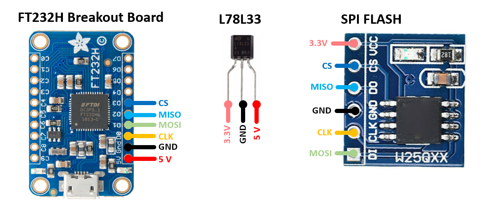
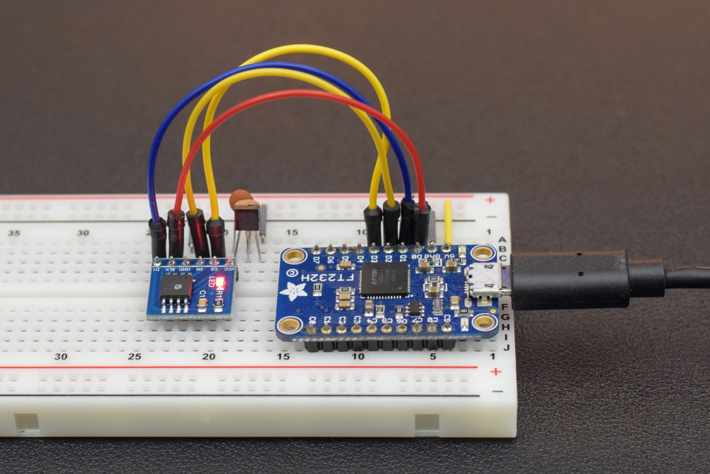
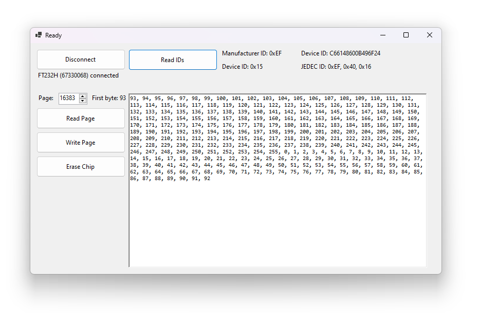
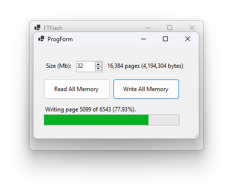

# FTFlash

**FTFlash is a Windows application for reading and writing FLASH memory in SPI chips using a FT232H.** A voltage regulator is required to step 5V down to 3.3V, but otherwise no external components are required. FTFlash allows for manual inspection of device information and reading/writing individual memory addresses as well as dumping/programming the entire memory to/from binary files on disk.

### Wiring

The photo of my breadboard shows a 0.1 µF decoupling capacitor to ground placed the the 3.3V line next to the regulator. It's probably not mandatory, but is a good idea to include on the output rail of linear voltage regulators to smooth out high frequency noise on the the supply line.

### Device and Memory Inspection

### Full Chip Read/Write

## Download FTFlash

* FTFlash.zip can be downloaded from the [Releases page](https://github.com/swharden/FTFlash/releases/)

## Resources

* [FtdiSharp](https://github.com/swharden/FtdiSharp)

* [W25Q32 Datasheet](https://www.elinux.org/images/f/f5/Winbond-w25q32.pdf)

* [FT232H Breakout Board](https://www.adafruit.com/product/2264) (Adafruit) has 3.3V built in and USBC

* [FT232H Breakout Board](https://www.amazon.com/dp/B09KGT5TGJ/) (Amazon) is cheaper with Prime shipping but has a less convenient PCB layout and silkscreen